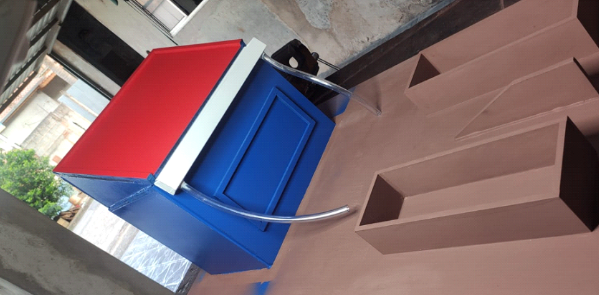
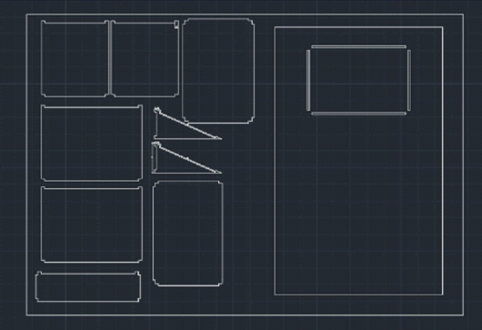
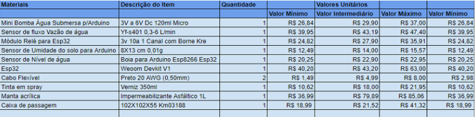

# **FarmFIT**

## __Introdução ao FarmFit__

 
 O Brasil é referência para o mundo inteiro no quesito do agronegócio, reconhecido mundialmente pela qualidade de seus solos, recursos naturais e produtividade rural. Mas, o que as pessoas não percebem é que neste mercado quem predomina são os pequenos e médios agricultores com baixo poder aquisitivo e que realizam trabalhos manuais, isto é, normalmente trata-se de tarefas sem nenhum tipo de tecnologia em todos os processos. Segundo dados do Governo Federal em 2022, cerca de 25% de toda a produção agrária nacional vem da agricultura familiar. 

 
 A partir deste fato, o mercado focou-se no desenvolvimento de soluções tecnológicas para as grandes fazendas e agricultores. Este público possui grande investimento e capacidade para investir em softwares designados para grandes controles de processos. O cenário atual  é de que normalmente são vendidos ERP 's e softwares complexos para o gerenciamento de grandes fazendas, não justificando a compra de um software robusto para o pequeno produtor, além disso, a agricultura é responsável por 70% do desperdício de água tratada no Brasil,  o uso irresponsável dos recursos naturais é um dos maiores problemas da sociedade. 

 
 Visando remediar esse problema, o projeto tem como objetivo o melhor planejamento do uso dos recursos hídricos de pequenos e médios agricultores, por meio da captação de águas pluviais e seu uso em sistemas de irrigação, sendo um produto low-cost e que possibilite a utilização do mesmo para todos os tipos de clientes. 

## __Objetivos Específicos__

 Com o objetivo de melhorar a administração dos recursos hídricos de pequenos e médios produtores, propõe-se a captação de águas pluviais na região de suas propriedades. Isso ocorre por meio de canos conectados às calhas de casas, barracões ou outras construções do local. Em seguida vem o armazenamento e o direcionamento para um sistema de irrigação. O tanque que estoca o líquido também pode ser preenchido manualmente ou ligado com a rede pública de abastecimento de água, de modo a não depender exclusivamente das chuvas e não comprometer a aguagem em períodos de estiagem. A rega é feita de modo a otimizar a utilização do líquido e evitar seu desperdício. Optou-se pela criação de um protótipo em escala que representa a iniciativa descrita instalada em uma quinta. 

 Ademais, dados a respeito do índice pluviométrico do local e da umidade do solo são coletados via sensores, os quais são disponibilizados em um aplicativo. Com tais informações, os agricultores têm os meios para tomada de decisões mais conscientes que melhorem a produtividade e a gestão de seus negócios de modo sustentável. 

## __JUSTIFICATIVA__ 

 Diversas notícias são publicadas cotidianamente a respeito da escassez hídrica e as dificuldades trazidas por ela. Estes problemas advêm da utilização exacerbada e incorreta da água e pelo descompromisso com a sustentabilidade. Desta forma, o projeto é desenvolvido com a finalidade de auxiliar na economia, no uso deste recurso e na consequente diminuição das despesas de maneira geral. 

 Para o alcance de tal objetivo, pretende-se construir um esquema de captação da água da chuva, a qual é utilizada em sistemas de irrigação, automatizado por um ESP-32 (placa de prototipagem semelhante a um Arduino). Com o desenvolvimento desta proposta, é possível o reaproveitamento da água, por meio das precipitações. Como consequência, pretende-se alcançar uma melhor administração dos recursos hídricos, redução dos gastos a longo prazo e a ampliação dos lucros. 

 A ideia para a elaboração de tal plano surgiu através da preocupação com a insuficiência de água em inúmeros âmbitos, e consequentemente, com a intenção de auxiliar a resolver este problema. Sendo assim, o uso sustentável deste recurso se mostrou como uma necessidade. 
 

 Depois de muito planejamento e pesquisa, foi decidido que o diferencial do projeto está relacionado a criação de um aplicativo que tornará possível a exposição dos dados relacionados a captação da água da chuva para o usuário. Com esse feedback, o planejamento e a organização poderão ser efetuados da melhor maneira possível, permitindo reduções de gastos e consequentemente o aumento dos lucros do agricultor. 

## __MATERIAIS E MÉTODOS__

 

 O protótipo desenvolvido consiste em uma casa de 30 cm por 30cm e 22 cm de altura apoiada sobre uma base retangular de 80 cm por 50 cm, ambas feitas de madeira MDF e banhadas em membrana acrílica, um impermeabilizante também conhecido como manta acrílica líquida. Esta estrutura é mostrada em Figura 1 e o desenho das peças que a compõem em Figura 2. Dois potes feitos do mesmo material contendo uma pequena horta de mini alfaces estão apoiados sobre o suporte, representando as plantações existentes nas propriedades rurais. 

 
Figura 1 - Estrutura em Madeira MDF 

 

 Fonte – Elaboração Própria
 

 

 
 Figura 2 – Desenho das peças usadas 

 
 

 Fonte – Elaboração Própria
 

  

   Ademais, cabos flexíveis estão conectados ao telhado da residência para, juntamente com um sensor de fluxo de água, representar o sistema de captação de águas pluviais. Eles são ligados a um aquário acrílico, usado como tanque de estocagem do recurso, e o conectam ao sistema de irrigação do pequeno canteiro, composto por um sensor de umidade do solo e uma mini válvula solenoide. Ambos os sensores citados estão conectados a um ESP-32, o qual é mantido em uma caixa de passagem. 

 O website, cuja página inicial pode ser vista em Figura 3, por sua vez, traz ao usuário um acesso fácil e rápido às informações coletadas pelos sensores. Ele foi estruturado usando o padrão proposto pelo framework Web do Python chamado Django. Esta ferramenta lida com o back-end (termo amplo que abrange operações no banco de dados, roteamento, autenticação, etc.), sendo responsável por atualizar dinamicamente os gráficos de umidade e fluxo d'água, visíveis nas Figuras 4 e 5, de acordo com novas entradas no banco de dados. O software XAMPP foi empregado a fim de hospedar um servidor local Apache, que permanece ativo para receber as requisições do ESP-32 contendo as leituras dos sensores, bem como um banco de dados MySQL, o qual é atualizado em seguida. Ademais, o Django oferece uma ORM nativa (camada entre o banco de dados e a linguagem em si) para facilitar a gestão do banco de dados. ChartJS, um API do JavaScript, foi utilizado no contexto de gerar gráficos com maior facilidade e nível de abstração, além de providenciar numerosas opções de estilização. Por fim, linguagens como HTML, CSS e JavaScript foram utilizadas no front-end, ou seja, aquilo que o usuário vê, de fato, ao acessar o site. 

## __Orçamento__

 O planejamento é uma etapa fundamental para o sucesso de um projeto. Nesse contexto, a pesquisa de valores dos itens e a realização do orçamento são mecanismos de controle imprescindíveis. É com isso que as informações sobre o desempenho financeiro da proposta em questão são extraídas. 

 Empregou-se a metodologia “bottom up”, uma estratégia cujo nome significa de baixo para cima, para o cálculo do orçamento. Nela são analisados, primeiramente, os aspectos financeiros e, posteriormente, a economia da empresa como um todo. Este método possui uma análise fundamentalista, sendo uma maneira de detalhar e verificar profundamente os dados de uma companhia (Jehniffer,2021). 

 Em razão do “bottom up”, três buscas diferentes para o preço de cada objeto foram feitas e, com a média dos valores encontrados, calculou-se o orçamento, como demonstrado na Figura 6. A estimativa final foi de R$ 198,81. Os links dos sites consultados estão no apêndice. 

  
 Figura 3 – Orçamento do Projeto 

  

  Fonte – Elaboração Própria
 

## __Retorno Esperado__

Como consequência de um planejamento bem estruturado e organizado do projeto de maneira geral, espera-se um retorno considerando aspectos econômicos e sociais.
 

 Em relação a perspectiva tangível, pode-se destacar:
 <ul>
     <li> Otimização sustentável da utilização da água </li>
     <li> Redução do consumo de água devido ao processo de captação </li>
     <li> Redução de custos em consequência a economia de água </li>
     <li> Melhor aproveitamento das águas pluviais </li>
 </ul>
  
 
 Em relação a perspectiva intangível, pode-se destacar:
 <ul>
     <li> Melhoria da administração dos recursos hídricos de pequenos e médios produtores </li>
     <li> Melhoria da produtividade de maneira geral </li>
     <li> Desenvolvimento de uma gestão de negócios mais sustentável </li>
     <li> Possibilidade de obtenção de feedback sobre o processo, contribuindo para tomada de decisões mais conscientes </li>
 </ul>

## __CONCLUSÃO__  

  

 
 O projeto foi muito bem estruturado e planejado, pois o mesmo foi desenvolvido inicialmente através de vários modelos de ilustração, uma vez que era necessário ter uma ideia mais clara sobre como seria o modelo físico. Como consequência, os testes se sucederam muito bem de maneira geral. O único contratempo foi em relação ao tamanho do telhado da estrutura, porém, esta peça foi substituída por outra com um tamanho superior, contribuindo para o encaixe perfeito da construção da casa. A estrutura utilizando a madeira do tipo MDF foi uma ótima escolha, pois o custo foi acessível e cumpriu muito bem sua função, dado que o material precisava resistir a manipulação de água. 
  

 O principal objetivo com este projeto foi alcançado com sucesso, visto que está relacionado a um ato sustentável, auxiliando na economia de água. O site também foi muito bem estruturado e desenvolvido, consequentemente, cumpre sua função de passar um feedback para o agricultor e ajudá-lo na administração do seu negócio de maneira geral. 

 

 Pensando no desenvolvimento de projetos futuros neste contexto, é possível adicionar o tratamento da água pluvial, em relação ao seu PH. Dessa forma, seria feito uma verificação da qualidade da água e posteriormente, de acordo com o resultado, decidiria a funcionalidade da mesma, como por exemplo, para lavar roupa ou utilizar para descargas. Porém, se a intenção fosse transformar este recurso em algo potável, seria necessário um tratamento específico e de qualidade. 
 
 

 Este trabalho contribuiu grandemente para a formação do grupo, pensando no contexto relacionado a ampliação de conhecimento, visto que desenvolveu-se um protótipo sustentável e um site. Para isso, buscou-se estudos e pesquisas sobre este tópico, realizou-se muitos testes e estudou-se sobre como desenvolver um site e concatená-lo a uma API em nuvem. 

## __APÊNDICE__ 

 
 Mini bomba água submersa para Arduino: 

 <ul> 
    <li> <a href="https://www.usinainfo.com.br/bombinha-de-agua-e-ar/mini-bomba-de-agua-submersa-25-a-6v-jt100-15lmin-4927.html"> https://www.usinainfo.com.br/bombinha-de-agua-e-ar/mini-bomba-de-agua-submersa-25-a-6v-jt100-15lmin-4927.html </a> </li>
    <li> <a href="https://www.mundorobotica.com.br/p-12140227-Mini-Bomba-Agua-Submersa-P_-Arduino_pic-120l_h"> https://www.mundorobotica.com.br/p-12140227-Mini-Bomba-Agua-Submersa-P_-Arduino_pic-120l_h </a> </li>
    <li> <a href="https://produto.mercadolivre.com.br/MLB-917776632-mini-bomba-agua-submersa-arduino-pic-120lh-3-a-6v-_JM"> https://produto.mercadolivre.com.br/MLB-917776632-mini-bomba-agua-submersa-arduino-pic-120lh-3-a-6v-_JM </a> </li>
 </ul>
 
  
 

 Sensor de fluxo vazão de água: 

 <ul> 
    <li> <a href="https://www.eletrogate.com/sensor-de-fluxo-de-agua-de-1-2"> https://www.eletrogate.com/sensor-de-fluxo-de-agua-de-1-2 </a> </li>
    <li> <a href="https://produto.mercadolivre.com.br/MLB-745460369-sensor-de-fluxo-ou-vazao-de-agua-12-1-30lmin-arduino-_JM"> https://produto.mercadolivre.com.br/MLB-745460369-sensor-de-fluxo-ou-vazao-de-agua-12-1-30lmin-arduino-_JM </a> </li>
    <li> <a href="https://www.baudaeletronica.com.br/sensor-de-fluxo-de-agua-yf-s401.html">	https://www.baudaeletronica.com.br/sensor-de-fluxo-de-agua-yf-s401.html </a> </li>
 </ul>
  
  
 

 Módulo Relé para ESP32: 

 <ul> 
    <li> <a href="https://www.baudaeletronica.com.br/modulo-rele-3v-com-borne-kre-2-canais.html"> https://www.baudaeletronica.com.br/modulo-rele-3v-com-borne-kre-2-canais.html </a> </li>
    <li> <a href="https://www.eletrogate.com/modulo-rele-1-canal-3v-10a-com-borne-kre-para-esp32">https://www.eletrogate.com/modulo-rele-1-canal-3v-10a-com-borne-kre-para-esp32 </a> </li>
    <li> <a href="https://produto.mercadolivre.com.br/MLB-1817834369-modulo-rele-3v-10a-1-canal-com-borne-kre-para-esp32-com-nota-_JM"> https://produto.mercadolivre.com.br/MLB-1817834369-modulo-rele-3v-10a-1-canal-com-borne-kre-para-esp32-com-nota-_JM </a> </li>
 </ul>

  
 

 Sensor de umidade do solo para Arduino: 

 <ul> 
    <li> <a href="https://www.amazon.com.br/Modulo-Sensor-Umidade-Solo-Arduino/dp/B084521TTJ/ref=asc_df_B084521TTJ/?tag=googleshopp06-20⦁	&⦁	linkCode=df0⦁	&⦁	hvadid=379729041276⦁	&⦁	hvpos=⦁	&⦁	hvnetw=g⦁	&⦁	hvrand=8442316345246917175⦁	&⦁	hvpone=⦁	&⦁	hvptwo=⦁	&⦁	hvqmt=⦁	&⦁	hvdev=m⦁	&⦁	hvdvcmdl=⦁	&⦁	hvlocint=⦁	&⦁	hvlocphy=9074249⦁	&⦁	hvtargid=pla-1417273696923⦁	&⦁	psc=1">https://www.amazon.com.br/Modulo-Sensor-Umidade-Solo-Arduino/dp/B084521TTJ/ref=asc_df_B084521TTJ/?tag=googleshopp06-20⦁	&⦁	linkCode=df0⦁	&⦁	hvadid=379729041276⦁	&⦁	hvpos=⦁	&⦁	hvnetw=g⦁	&⦁	hvrand=8442316345246917175⦁	&⦁	hvpone=⦁	&⦁	hvptwo=⦁	&⦁	hvqmt=⦁	&⦁	hvdev=m⦁	&⦁	hvdvcmdl=⦁	&⦁	hvlocint=⦁	&⦁	hvlocphy=9074249⦁	&⦁	hvtargid=pla-1417273696923⦁	&⦁	psc=1</a> </li>
    <li> <a href="https://produto.mercadolivre.com.br/MLB-808263659-sensor-de-umidade-do-solo-_JM">https://produto.mercadolivre.com.br/MLB-808263659-sensor-de-umidade-do-solo-_JM </a> </li>
    <li> <a href="https://www.baudaeletronica.com.br/sensor-de-umidade-do-solo.html">	https://www.baudaeletronica.com.br/sensor-de-umidade-do-solo.html </a> </li>
 </ul>
 
 
 

 Sensor de nível de água: 

 <ul> 
    <li> <a href="https://produto.mercadolivre.com.br/MLB-869422606-boia-sensor-nivel-lateral-magnetico-agua-arduino-_JM">https://produto.mercadolivre.com.br/MLB-869422606-boia-sensor-nivel-lateral-magnetico-agua-arduino-_JM</a> </li>
    <li> <a href="https://www.robocore.net/sensor-robo/sensor-de-nivel-de-agua-boia-plastica-preta?gclid=CjwKCAjw1ICZBhAzEiwAFfvFhBeHCYJBKMEdpFvP6SAQ0lW7aTAtWrAXUF4Y9ttLcE74RBLh9um2wBoC66wQAvD_BwE">https://produto.mercadolivre.com.br/MLB-808263659-sensor-de-umidade-do-solo-_JM </a> </li>
    <li> <a href="https://www.baudaeletronica.com.br/sensor-de-nivel-de-agua.html">	https://www.baudaeletronica.com.br/sensor-de-nivel-de-agua.html </a> </li>
 </ul>
  
 
 

 ESP32: 

 <ul> 
    <li> <a href="https://www.curtocircuito.com.br/placa-doit-esp32-esp32-wroom-32d-wifi-bluetooth.html">https://www.curtocircuito.com.br/placa-doit-esp32-esp32-wroom-32d-wifi-bluetooth.html</a> </li>
    <li> <a href="https://produto.mercadolivre.com.br/MLB-1891932161-esp32-wifi-bluetooth-esp32s-esp-wroom-32-_JM">https://produto.mercadolivre.com.br/MLB-1891932161-esp32-wifi-bluetooth-esp32s-esp-wroom-32-_JM</a> </li>
    <li> <a href="https://www.baudaeletronica.com.br/modulo-wifi-esp8266-nodemcu-esp-12e.html">https://www.baudaeletronica.com.br/modulo-wifi-esp8266-nodemcu-esp-12e.html </a> </li>
 </ul>
   
 
 

 Cabo Flexível: 

 <ul> 
    <li> <a href="https://www.soferragenstb.com.br/cabo-flexivel-6-00mm-450-750v-preto-vendido-por-metro/p/1031">https://www.soferragenstb.com.br/cabo-flexivel-6-00mm-450-750v-preto-vendido-por-metro/p/1031</a> </li>
    <li> <a href="https://www.baudaeletronica.com.br/cabo-flexivel-preto-20-awg-0-50mm-por-metro.html">https://www.baudaeletronica.com.br/cabo-flexivel-preto-20-awg-0-50mm-por-metro.html</a> </li>
    <li> <a href="https://www.eletrofio.com/fios-e-cabos/sil/sil-10mm/cabo-flexivel-10mm-1-metros-preto-sil">https://www.eletrofio.com/fios-e-cabos/sil/sil-10mm/cabo-flexivel-10mm-1-metros-preto-sil</a> </li>
 </ul>
    
 
 

 Tinta Spray Verniz 350 ml: 

 <ul> 
    <li> <a href="https://www.casasbahia.com.br/tinta-spray-verniz-350ml-tekbond-1510135891/p/1510135891?utm_medium=Cpc⦁	&⦁	utm_source=GP_PLA⦁	&⦁	IdSku=1510135891⦁	&⦁	idLojista=20362⦁	&⦁	tipoLojista=3P⦁	&⦁	&⦁	utm_campaign=3p_gg_pmax_longtail_casa⦁	&⦁	gclid=Cj0KCQiAmaibBhCAARIsAKUlaKS10exhCXAua22aADXyP70N3ihQS8CW5wxYNyhg2yPzH97C-iKZAgMaAu0XEALw_wcB⦁	&⦁	gclsrc=aw.ds">https://www.casasbahia.com.br/tinta-spray-verniz-350ml-tekbond-1510135891/p/1510135891?utm_medium=Cpc⦁	&⦁	utm_source=GP_PLA⦁	&⦁	IdSku=1510135891⦁	&⦁	idLojista=20362⦁	&⦁	tipoLojista=3P⦁	&⦁	&⦁	utm_campaign=3p_gg_pmax_longtail_casa⦁	&⦁	gclid=Cj0KCQiAmaibBhCAARIsAKUlaKS10exhCXAua22aADXyP70N3ihQS8CW5wxYNyhg2yPzH97C-iKZAgMaAu0XEALw_wcB⦁	&⦁	gclsrc=aw.ds</a> </li>
    <li> <a href="https://www.amazon.com.br/Tinta-Spray-Primer-Fundo-350Ml/dp/B0787BZ9DC/ref=asc_df_B0787BZ9DC/?tag=googleshopp00-20⦁	&⦁	linkCode=df0⦁	&⦁	hvadid=379815098360⦁	&⦁	hvpos=⦁	&⦁	hvnetw=g⦁	&⦁	hvrand=16030786739732587136⦁	&⦁	hvpone=⦁	&⦁	hvptwo=⦁	&⦁	hvqmt=⦁	&⦁	hvdev=c⦁	&⦁	hvdvcmdl=⦁	&⦁	hvlocint=⦁	&⦁	hvlocphy=9100719⦁	&⦁	hvtargid=pla-1394051388428⦁	&⦁	psc=1">https://www.amazon.com.br/Tinta-Spray-Primer-Fundo-350Ml/dp/B0787BZ9DC/ref=asc_df_B0787BZ9DC/?tag=googleshopp00-20⦁	&⦁	linkCode=df0⦁	&⦁	hvadid=379815098360⦁	&⦁	hvpos=⦁	&⦁	hvnetw=g⦁	&⦁	hvrand=16030786739732587136⦁	&⦁	hvpone=⦁	&⦁	hvptwo=⦁	&⦁	hvqmt=⦁	&⦁	hvdev=c⦁	&⦁	hvdvcmdl=⦁	&⦁	hvlocint=⦁	&⦁	hvlocphy=9100719⦁	&⦁	hvtargid=pla-1394051388428⦁	&⦁	psc=1</a> </li>
    <li> <a href="https://www.amazon.com.br/Tekbond-62693-Tinta-Spray-Multicolor/dp/B078YX49LC/ref=asc_df_B078YX49LC/?tag=googleshopp00-20⦁	&⦁	linkCode=df0⦁	&⦁	hvadid=379793410991⦁	&⦁	hvpos=⦁	&⦁	hvnetw=g⦁	&⦁	hvrand=16030786739732587136⦁	&⦁	hvpone=⦁	&⦁	hvptwo=⦁	&⦁	hvqmt=⦁	&⦁	hvdev=c⦁	&⦁	hvdvcmdl=⦁	&⦁	hvlocint=⦁	&⦁	hvlocphy=9100719⦁	&⦁	hvtargid=pla-975258847383⦁	&⦁	psc=1">https://www.amazon.com.br/Tekbond-62693-Tinta-Spray-Multicolor/dp/B078YX49LC/ref=asc_df_B078YX49LC/?tag=googleshopp00-20⦁	&⦁	linkCode=df0⦁	&⦁	hvadid=379793410991⦁	&⦁	hvpos=⦁	&⦁	hvnetw=g⦁	&⦁	hvrand=16030786739732587136⦁	&⦁	hvpone=⦁	&⦁	hvptwo=⦁	&⦁	hvqmt=⦁	&⦁	hvdev=c⦁	&⦁	hvdvcmdl=⦁	&⦁	hvlocint=⦁	&⦁	hvlocphy=9100719⦁	&⦁	hvtargid=pla-975258847383⦁	&⦁	psc=1</a> </li>
 </ul>
     
 
 

 Caixa de Passagem: 

 <ul> 
    <li> <a href="https://produto.mercadolivre.com.br/MLB-2037936276-caixa-de-passagem-102x102x55-km03186-steck-ssx111-cftv-_JM?matt_tool=56291529⦁	&⦁	matt_word=⦁	&⦁	matt_source=google⦁	&⦁	matt_campaign_id=14303413604⦁	&⦁	matt_ad_group_id=133074303519⦁	&⦁	matt_match_type=⦁	&⦁	matt_network=g⦁	&⦁	matt_device=c⦁	&⦁	matt_creative=584156655498⦁	&⦁	matt_keyword=⦁	&⦁	matt_ad_position=⦁	&⦁	matt_ad_type=pla⦁	&⦁	matt_merchant_id=487183639⦁	&⦁	matt_product_id=MLB2037936276⦁	&⦁	matt_product_partition_id=1413191054866⦁	&⦁	matt_target_id=aud-1457490208548:pla-1413191054866⦁	&⦁	gclid=Cj0KCQiAmaibBhCAARIsAKUlaKTIAUYCrD6RjdHtc6Zr0uTTlxNyr-IjQvhmOPLPzs4lDuCaS8I7ZcEaAtjmEALw_wcB">https://produto.mercadolivre.com.br/MLB-2037936276-caixa-de-passagem-102x102x55-km03186-steck-ssx111-cftv-_JM?matt_tool=56291529⦁	&⦁	matt_word=⦁	&⦁	matt_source=google⦁	&⦁	matt_campaign_id=14303413604⦁	&⦁	matt_ad_group_id=133074303519⦁	&⦁	matt_match_type=⦁	&⦁	matt_network=g⦁	&⦁	matt_device=c⦁	&⦁	matt_creative=584156655498⦁	&⦁	matt_keyword=⦁	&⦁	matt_ad_position=⦁	&⦁	matt_ad_type=pla⦁	&⦁	matt_merchant_id=487183639⦁	&⦁	matt_product_id=MLB2037936276⦁	&⦁	matt_product_partition_id=1413191054866⦁	&⦁	matt_target_id=aud-1457490208548:pla-1413191054866⦁	&⦁	gclid=Cj0KCQiAmaibBhCAARIsAKUlaKTIAUYCrD6RjdHtc6Zr0uTTlxNyr-IjQvhmOPLPzs4lDuCaS8I7ZcEaAtjmEALw_wcB</a> </li>
    <li> <a href="https://produto.mercadolivre.com.br/MLB-2779201960-caixa-de-passagem-102x102x55-km03186-steck-ssx111-cftv-biki-_JM?matt_tool=14804773⦁	&⦁	matt_word=⦁	&⦁	matt_source=google⦁	&⦁	matt_campaign_id=14302215543⦁	&⦁	matt_ad_group_id=134553705348⦁	&⦁	matt_match_type=⦁	&⦁	matt_network=g⦁	&⦁	matt_device=c⦁	&⦁	matt_creative=539425529185⦁	&⦁	matt_keyword=⦁	&⦁	matt_ad_position=⦁	&⦁	matt_ad_type=pla⦁	&⦁	matt_merchant_id=363690814⦁	&⦁	matt_product_id=MLB2779201960⦁	&⦁	matt_product_partition_id=1404320022641⦁	&⦁	matt_target_id=aud-1454065851987:pla-⦁	1404320022641⦁	&⦁	gclid=Cj0KCQiAmaibBhCAARIsAKUlaKSHKbkOtaA-_6OsLzKTzSLU33w8s5g-lvk9G_NKjQar0b5mW2pMu2UaAnq0EALw_wcB">https://produto.mercadolivre.com.br/MLB-2779201960-caixa-de-passagem-102x102x55-km03186-steck-ssx111-cftv-biki-_JM?matt_tool=14804773⦁	&⦁	matt_word=⦁	&⦁	matt_source=google⦁	&⦁	matt_campaign_id=14302215543⦁	&⦁	matt_ad_group_id=134553705348⦁	&⦁	matt_match_type=⦁	&⦁	matt_network=g⦁	&⦁	matt_device=c⦁	&⦁	matt_creative=539425529185⦁	&⦁	matt_keyword=⦁	&⦁	matt_ad_position=⦁	&⦁	matt_ad_type=pla⦁	&⦁	matt_merchant_id=363690814⦁	&⦁	matt_product_id=MLB2779201960⦁	&⦁	matt_product_partition_id=1404320022641⦁	&⦁	matt_target_id=aud-1454065851987:pla-⦁	1404320022641⦁	&⦁	gclid=Cj0KCQiAmaibBhCAARIsAKUlaKSHKbkOtaA-_6OsLzKTzSLU33w8s5g-lvk9G_NKjQar0b5mW2pMu2UaAnq0EALw_wcB </a> </li>
    <li> <a href="https://www.amazon.com.br/Steck-SSX161-Caixa-Passagem-Light/dp/B07DDSSZVN/ref=asc_df_B07DDSSZVN/?tag=googleshopp00-20⦁	&⦁	linkCode=df0⦁	&⦁	hvadid=379728572827⦁	&⦁	hvpos=⦁	&⦁	hvnetw=g⦁	&⦁	hvrand=12647609474866675651⦁	&⦁	hvpone=⦁	&⦁	hvptwo=⦁	&⦁	hvqmt=⦁	&⦁	hvdev=c⦁	&⦁	hvdvcmdl=⦁	&⦁	hvlocint=⦁	&⦁	hvlocphy=9100719⦁	&⦁	hvtargid=pla-810113744294⦁	&⦁	psc=1">https://www.amazon.com.br/Steck-SSX161-Caixa-Passagem-Light/dp/B07DDSSZVN/ref=asc_df_B07DDSSZVN/?tag=googleshopp00-20⦁	&⦁	linkCode=df0⦁	&⦁	hvadid=379728572827⦁	&⦁	hvpos=⦁	&⦁	hvnetw=g⦁	&⦁	hvrand=12647609474866675651⦁	&⦁	hvpone=⦁	&⦁	hvptwo=⦁	&⦁	hvqmt=⦁	&⦁	hvdev=c⦁	&⦁	hvdvcmdl=⦁	&⦁	hvlocint=⦁	&⦁	hvlocphy=9100719⦁	&⦁	hvtargid=pla-810113744294⦁	&⦁	psc=1
</a> </li>
 </ul>
     
 
 

 Manta Acrílica: 

 <ul> 
    <li> <a href="https://www.amazon.com.br/Emuls%C3%A3o-Asf%C3%A1ltica-Neutrol-900ml-Vedacit/dp/B07FSTSH2K/ref=asc_df_B07FSTSH2K/?tag=googleshopp00-20⦁	&⦁	linkCode=df0⦁	&⦁	hvadid=379815098360⦁	&⦁	hvpos=⦁	&⦁	hvnetw=g⦁	&⦁	hvrand=6371274319241999173⦁	&⦁	hvpone=⦁	&⦁	hvptwo=⦁	&⦁	hvqmt=⦁	&⦁	hvdev=c⦁	&⦁	hvdvcmdl=⦁	&⦁	hvlocint=⦁	&⦁	hvlocphy=9100719⦁	&⦁	hvtargid=pla-1676370590845⦁	&⦁	psc=1">https://www.amazon.com.br/Emuls%C3%A3o-Asf%C3%A1ltica-Neutrol-900ml-Vedacit/dp/B07FSTSH2K/ref=asc_df_B07FSTSH2K/?tag=googleshopp00-20⦁	&⦁	linkCode=df0⦁	&⦁	hvadid=379815098360⦁	&⦁	hvpos=⦁	&⦁	hvnetw=g⦁	&⦁	hvrand=6371274319241999173⦁	&⦁	hvpone=⦁	&⦁	hvptwo=⦁	&⦁	hvqmt=⦁	&⦁	hvdev=c⦁	&⦁	hvdvcmdl=⦁	&⦁	hvlocint=⦁	&⦁	hvlocphy=9100719⦁	&⦁	hvtargid=pla-1676370590845⦁	&⦁	psc=1</a> </li>
    <li> <a href="https://www.sacitintas.com.br/impermeabilizante-rodape-bautech-4-kg/p?idsku=771⦁	&⦁	gclid=Cj0KCQiAmaibBhCAARIsAKUlaKSugff7htPKXgqlvKBILqSkSe5rZmhwdWuBrZASbv5hcIwRk_Jcq-UaAv1DEALw_wcB">https://www.sacitintas.com.br/impermeabilizante-rodape-bautech-4-kg/p?idsku=771⦁	&⦁	gclid=Cj0KCQiAmaibBhCAARIsAKUlaKSugff7htPKXgqlvKBILqSkSe5rZmhwdWuBrZASbv5hcIwRk_Jcq-UaAv1DEALw_wcB</a> </li>
    <li> <a href="https://www.cec.com.br/tintas-e-acessorios/vedacao-e-impermeabilizacao/manta-liquida-acrilica-vedalage-branca-3-6kg?produto=1370421⦁	&⦁	idpublicacao=791d2005-d206-4804-b297-71cab438caf1⦁	&⦁	gclid=Cj0KCQiAmaibBhCAARIsAKUlaKTj3sk5b0J5RBmYKyazYqJN2yX21_2boddFYpp0kMYpsDVGv5aBdnIaAia8EALw_wcB">https://www.cec.com.br/tintas-e-acessorios/vedacao-e-impermeabilizacao/manta-liquida-acrilica-vedalage-branca-3-6kg?produto=1370421⦁	&⦁	idpublicacao=791d2005-d206-4804-b297-71cab438caf1⦁	&⦁	gclid=Cj0KCQiAmaibBhCAARIsAKUlaKTj3sk5b0J5RBmYKyazYqJN2yX21_2boddFYpp0kMYpsDVGv5aBdnIaAia8EALw_wcB
</a> </li>
 </ul>
 

